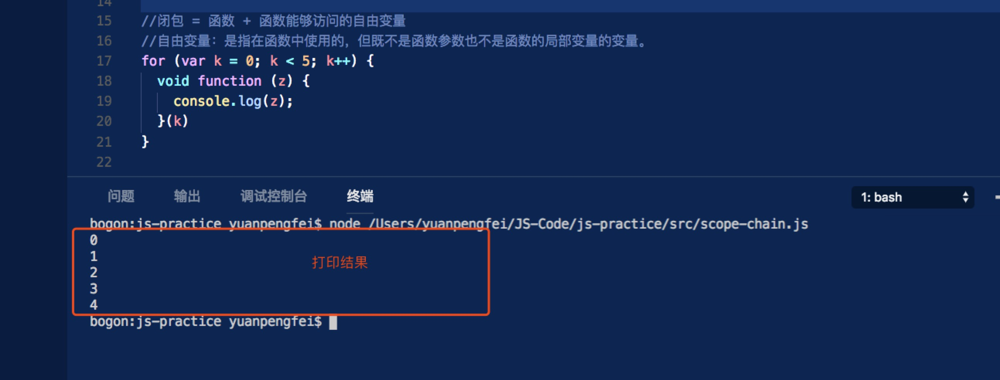
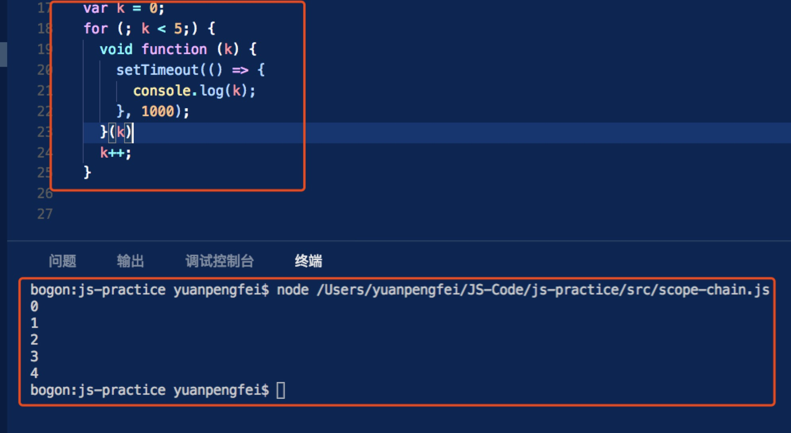

# 闭包 = 函数 + 函数能够访问的自由变量

> 自由变量：是指在函数中使用的，但既不是函数参数也不是函数的局部变量的变量。

```javascript
  for (var k = 0; k < 5; k++) {
    void function () {
      console.log(k);
    }()
  }
```

首先看看这段代码的打印结果：



此处for循环内是一个我们常说的立即执行（匿名）函数，此匿名函数的参数是 k ;这个 k 就是自由变量,为什么呢？

因为，对于匿名函数而言，参数是 z ,函数内部不存在局部变量；由于变量提升，代码其实可以写成这样：

```javascript
  var k = 0;

  for (; k < 5; ) {

    void function () {
      console.log(k);
    }()

    k++;
  }
```

因此，k 其实是一个全局变量， 根据闭包的定义：**闭包 = 函数 + 函数能够访问的自由变量**，所以此处产生闭包。

好的，下面我分再来“鞭尸”上次的那个历史遗留问题：

```javascript
  var k = 0;
  for (; k < 5; ) {
    void function (j) {
      setTimeout(() => {
        //这个匿名函数出产生闭包
        console.log(j);//此处的j是自由变量
      }, 1000);
    }(k)
    k++;
  }
```

打印结果如图：



其实看到这基本上已经明白这个闭包实现的过程了，也就无需多言了，如果真的对闭包还又不太理解的地方，那么推荐你去看一篇文章：

[深入闭包](https://github.com/mqyqingfeng/Blog/issues/9)
